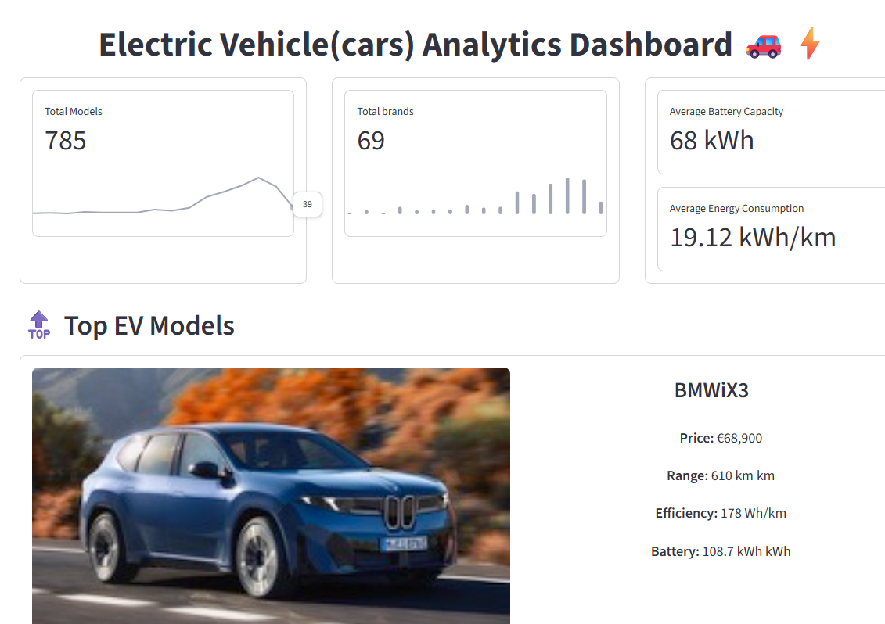
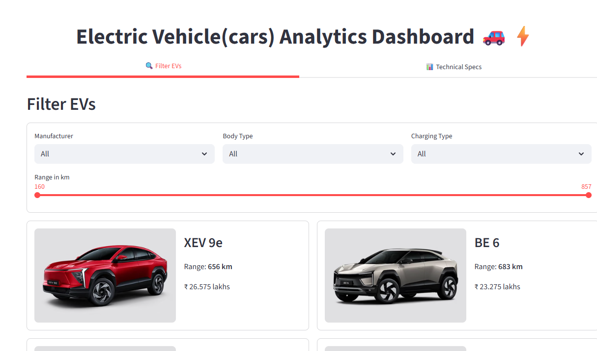
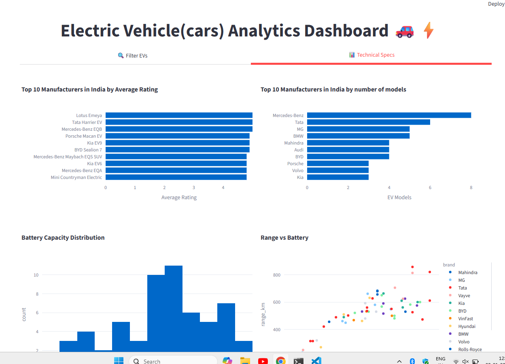
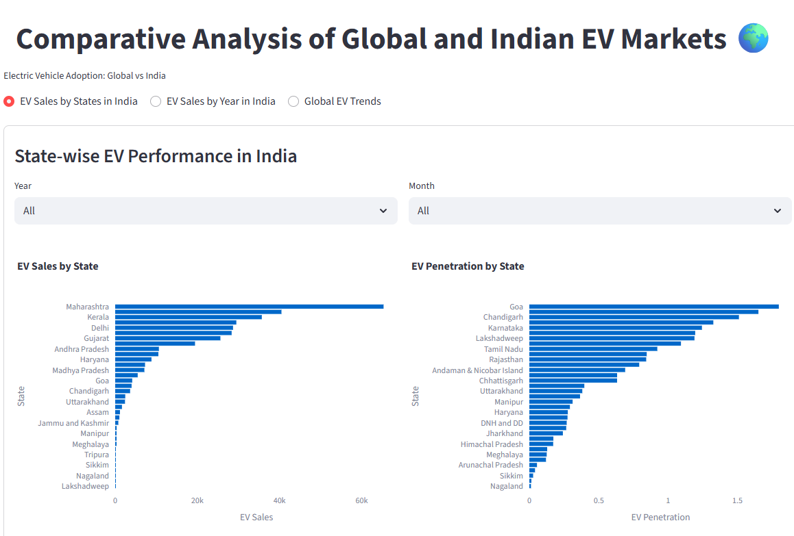
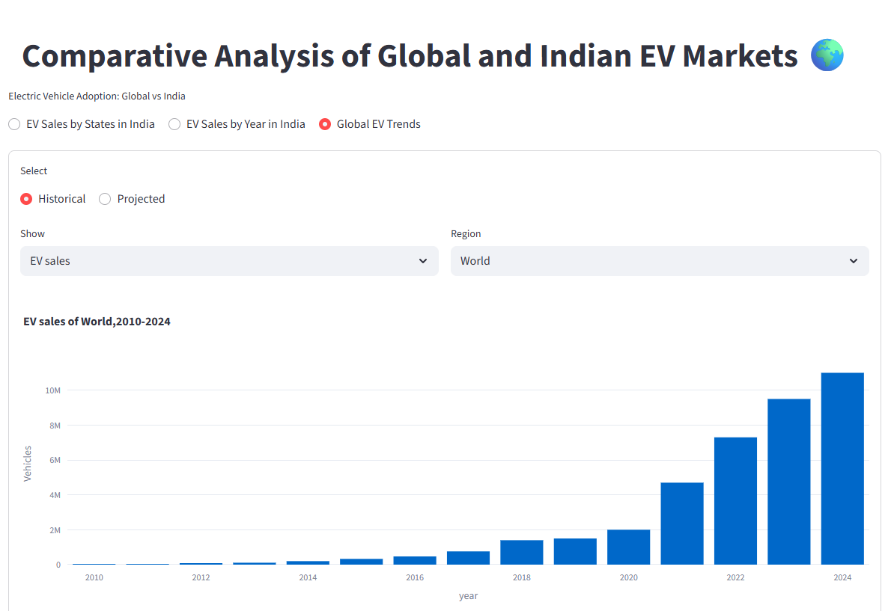
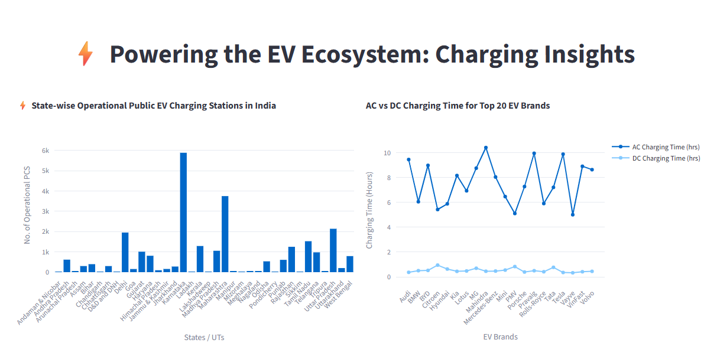
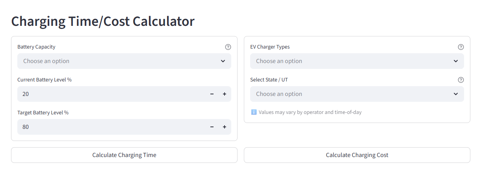
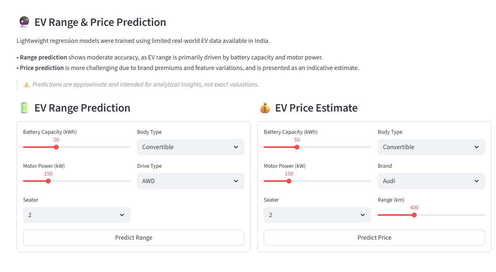
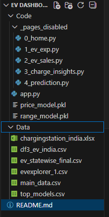

## ⚡ Electric Vehicle Analytics Dashboard

An interactive end‑to‑end data analytics and machine learning dashboard built using Python, Streamlit, and Plotly, focused on analyzing Electric Vehicle (EV) adoption, sales, charging infrastructure, and predictive insights in India and globally.

This project combines data analysis, visualization, and lightweight ML models into a single production‑style dashboard suitable for portfolio, learning, and exploratory analysis.
## Features Overview
1. EV Overview
* Total EV models & brands
* Average battery capacity & energy consumption
* Dynamic KPI cards
* Auto‑rotating showcase of top EV models

2. EV Explorer(India)
* Filter & explore EV models based on:
    - Manufacturer
    - Body type
    - Charging port
    - Range

    

* Technical insights include:
    - Top brands by rating
    - Models count by brand
    - Battery capacity distribution
    - Range vs battery relationship
    - Price & range distributions
    - Body‑type market share

    
3. EV Sales Analytics
* India‑Focused Analysis:
    - State‑wise EV sales
    - Year‑wise EV adoption trends
    - EV penetration percentage over time
    - Month & year dynamic filtering

    

* Global EV Trends:
    - Historical vs projected EV sales
    - Battery demand growth
    - Regional comparisons (World / Country level)

    
4. Charging Infrastructure Insights
* State‑wise public EV charging stations in India
* AC vs DC charging time comparison (top brands)
* Interactive EV Charging Time & Cost Calculator
    - Based on charger type
    - State‑wise electricity tariff
    - Charging efficiency losses

    
    
5. EV Range & Price Prediction (ML)
* Two lightweight regression models trained on real‑world Indian EV data
* Range Prediction
    - Inputs: Battery capacity, motor power, body type, drive type, seating
    - Performance: Moderate accuracy (R² ≈ 0.56)
* Price Prediction
    - Inputs: Battery, motor power, range, brand, body type
    - Performance: Indicative estimates (R² ≈ 0.35)
⚠️ Predictions are approximate and intended for analytical insights, not exact valuations.

## Tech Stack

* Python
* Streamlit – interactive dashboard
* Pandas & NumPy – data processing
* Plotly – interactive visualizations
* Scikit‑learn – regression models
* Pickle – model persistence

## 📁 Project Structure

## Key Learnings

* Handling multi‑source datasets (CSV, Excel)
* Building scalable Streamlit dashboards
* Optimizing performance using caching
* Designing user‑centric analytics UI
* Training & deploying ML models inside dashboards
* Communicating model limitations responsibly

## Limitations

* Limited Indian EV dataset (~60 models) for ML
* Claimed ranges may vary from real‑world performance
* Price predictions influenced by brand premiums
* These limitations are explicitly communicated inside the dashboard.

## 🙏 Acknowledgements

* Government open EV datasets
* Vahan portal (aggregated insights)
* Public EV specification sources

## 👩‍💻 Author

Bindhya K
Aspiring Data Scientist | Data Analyst | Python Developer

📌 If you found this project useful, feel free to ⭐ the repository!